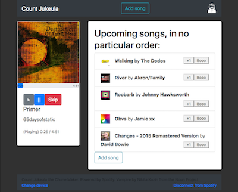

# Count Jukeula

Colaborative jukebox web interface, with playback backed by the Spotify desktop client.

Intended to be used in an office, where multiple people wish to queue songs.

## Requirements

1. Spotify desktop client for playback.
2. The Rust language toolkit (easiest to install via [rustup](https://rustup.rs/)). 

    Initially developed on Rust 1.31 (edition 2018). Should work on latest stable, support for older versions isn't a high priority.
3. Web-app targets mostly used in recent versions of Firefox/Chrome.

The only networking requirements are:

1. Spotify client must be connected to the internet (i.e it will not work in Spotify's Offline mode)
2. The Jukeula server must have access to the Spotify web API.
3. Users must have access to the Jukeula web interface.

## Running

1. Launch and log in to a [Spotify client](https://www.spotify.com) on an internet connected machine (currently only tested with the Spotify desktop client on macOS)

2. Install the Rust language toolchain (easiest via [rustup](https://rustup.rs/))

3. Sign in to the [Spotify for Developers](https://developer.spotify.com/dashboard/login) dashboard (with a regular Spotify account), and click "create a client ID".

    The process is simple/quick, and you will end up with a "Client ID" and a "Client Secret".

    Also ensure the "Redirect URIs" is set properly (this can be set to `http://localhost:8081/postauth` )

4. Put the Spotify details in a `.env` file:

    CLIENT_ID=a0b2c3.....f1
    CLIENT_SECRET=f0e1d2...a0
    REDIRECT_URI=http://localhost:8081/postauth

5. Launch the Rust-based Jukeula server. This can be on a completely different machine/network to the Spotify client, as long as both have access to the Spotify API.

    In a terminal run:

        $ cargo run
        [...]
        Listening on http://0.0.0.0:8081

6. Access the web interface as per the URL in the terminal output.

7. On the initial access, you will need to log in with Spotify to authorise the API access for Jukeula. Click the link, and ensure you are logging in with the same account as running the Spotify desktop client. Then select the correct playback device.

## Usage

Click "Add song", search for something (artist/song title or a combination fo the two), and click add. The song appears up in Jukeula's "Upcoming songs" list.

If the Spotify client "needs a song", a song from Jukeula's queue will be played. This repeats until the Jukeula queue is empty.

If the Spotify client is used for something else (e.g someone starts playing a playlist in the Spotify client), Jukeula will not do anything until playback stops.

However if the "Skip" button is clicked in Jukeula, it will override
